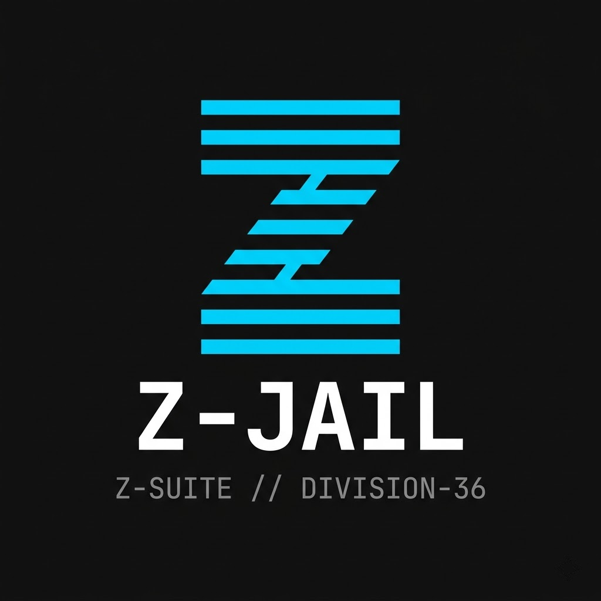
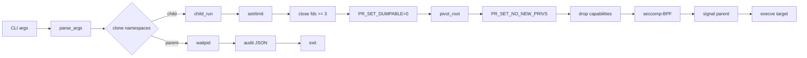
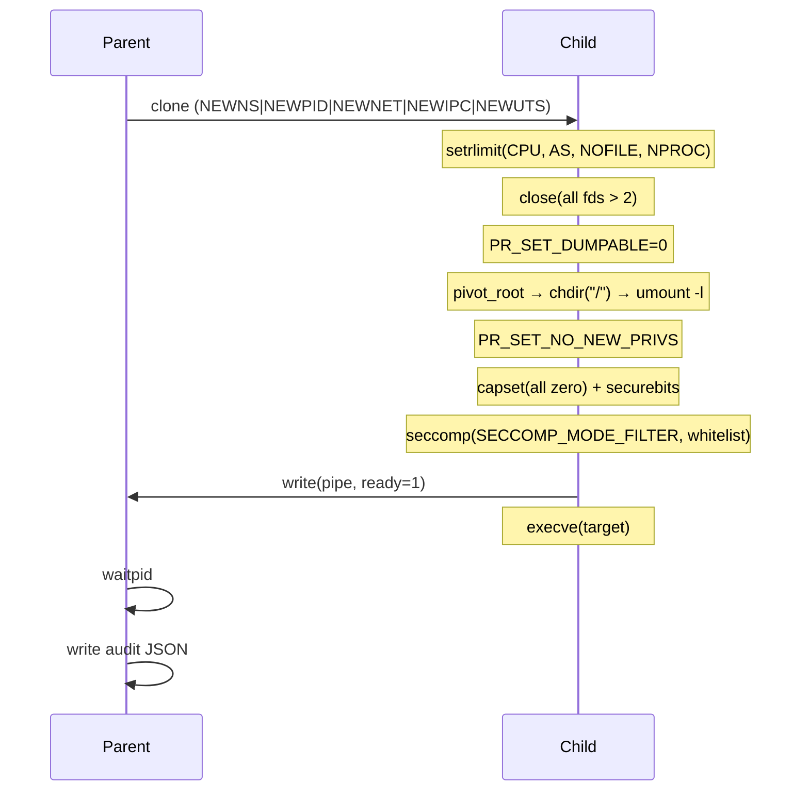

<div align="center">
  
  <h1>Z-Jail</h1>
  <p>
    Multi-layer sandbox for native code execution on Linux.<br/>
    Seven ordered isolation layers — no external dependencies, ~81 KiB PIE binary.
  </p>
  
  
  
  
</div>

---

```text
┌──────────────────────────────────────────────────────┐
│                    Z-Jail                            │
├──────────────────────────────────────────────────────┤
│  Namespaces       (mount, pid, net, ipc, uts)        │
│  pivot_root       (chroot on steroids)               │
│  Capabilities     (drop all, lock securebits)        │
│  NO_NEW_PRIVS     (no privilege escalation)          │
│  seccomp-BPF      (whitelist-v1: 24 syscalls)      │
│  Audit            (JSON logging + BLAKE2b hashing)   │
└──────────────────────────────────────────────────────┘
```

---

## Table of Contents

- [Quick Start](#quick-start)
- [Why Z-Jail](#why-z-jail)
- [Architecture](#architecture)
- [Layers](#layers)
- [Usage](#usage)
- [Build & Install](#build--install)
- [Testing](#testing)
- [Performance](#performance)
- [Threat Model](#threat-model)
- [Documentation](#documentation)
- [Roadmap](#roadmap)
- [License](#license)

---

## Quick Start

```sh
git clone https://github.com/Division-36/Z-Jail.git
cd Z-Jail
make
sudo ./z_jail --root=/path/to/rootfs --seccomp-enforce -- /bin/ls
```

The `--root` directory should contain a minimal filesystem with the target binary and its dependencies (for static binaries, just the binary is enough).

---

## Why Z-Jail

Existing sandboxing solutions make trade-offs:

|                    | **Z-Jail**  | **Firecracker** | **gVisor** | **bwrap** | **nsjail** |
|--------------------|-------------|-----------------|------------|-----------|------------|
| External deps      | **zero**    | libc, seccomp   | Go runtime | libc      | libc, protobuf |
| Binary size        | **~81 KiB** | 20+ MiB         | 40+ MiB    | ~70 KiB   | ~1 MiB     |
| VM isolation       | no          | yes (microVM)   | no (sandbox)| no        | no        |
| seccomp whitelist  | **yes**     | no              | yes        | optional  | yes        |
| Content hashing    | **yes**     | no              | no         | no        | no         |
| Audit JSON         | **yes**     | no              | yes        | no        | partial    |
| Build complexity   | **one `make`** | complex     | complex    | trivial   | moderate   |

Z-Jail fills the niche between `bwrap` (minimal, no seccomp-by-default) and `nsjail` (featureful, heavy deps). It is designed for **CI pipelines, CTF jail challenges, and lightweight code evaluation** where you need defence-in-depth without pulling in a container runtime.

---

## Architecture

### Data Flow



### Layer Ordering

Each layer is ordered so that a later layer can't be undone by an earlier one:

1. **setrlimit** — cap CPU, address space, file count, processes before anything else
2. **fd scrub** — close all inherited fds except the report pipe
3. **PR_SET_DUMPABLE=0** — core dumps disabled, /proc/self/mem locked down
4. **pivot_root** — detach from host filesystem; old root unmounted lazily
5. **PR_SET_NO_NEW_PRIVS** — no setuid, no `capset` escalation after this point
6. **drop_caps** — zero out all capabilities, lock securebits
7. **seccomp-BPF** — restrict syscalls to whitelist only
8. **signal parent** — tell the parent the sandbox is ready
9. **execve** — replace process with the target binary



---

## Layers

TAC applies seven ordered isolation mechanisms in the child before `execve`,
each chosen so that a later step cannot be undone by re-executing an earlier one.
The parent creates the child with `clone()` requesting five namespaces
(mount, PID, network, IPC, UTS), then the child runs the following pipeline:

### 1. Resource limits
`setrlimit` caps CPU time, address space, open files, and process count
before any guest-influenced code runs, bounding fork bombs and memory exhaustion.

### 2. File-descriptor scrub
All inherited descriptors except the parent report pipe are closed,
preventing leaked handles from crossing `execve`.

### 3. Dumpability off
`PR_SET_DUMPABLE=0` disables core dumps and restricts `/proc/self/mem` access.

### 4. `pivot_root`
The mount namespace root is replaced with the supplied root directory:
the directory is bind-mounted onto itself, `pivot_root` swaps the mount tree,
the process `chdir`s to the new root, and the old root is lazily detached
and removed. This is strictly stronger than `chroot(2)` because the previous
root is unmounted rather than merely hidden.

### 5. `NO_NEW_PRIVS`
`PR_SET_NO_NEW_PRIVS` prevents any subsequent privilege gain through setuid
binaries, file capabilities, or LSM transitions. Irreversible.

### 6. Capability drop
User and group IDs are changed while `CAP_SETUID` is still held, after which
`capset` zeroes all capability sets and the securebits are locked, so
capabilities cannot be re-enabled.

### 7. seccomp-BPF (whitelist-v1)
A whitelist filter is installed; non-whitelisted calls are terminated.
Allow-list of 24 syscalls:

| Syscall | Number | Notes |
|---------|--------|-------|
| `read` | 0 | stdin |
| `write` | 1 | stdout/stderr + report pipe |
| `openat` | 257 | file access (not `open`) |
| `close` | 3 | — |
| `lseek` | 8 | — |
| `brk` | 12 | heap management |
| `mmap` | 9 | arg-restricted: `flags & 4 == 0` (no MAP_SHARED), `flags == 0x22` (MAP_PRIVATE\|MAP_ANONYMOUS) |
| `munmap` | 11 | — |
| `execve` | 59 | single exec at startup |
| `exit_group` | 231 | clean process exit |
| `rt_sigaction` | 13 | signal handlers |
| `rt_sigprocmask` | 14 | signal masking |
| `getrandom` | 318 | random number source |
| `clock_gettime` | 228 | timing |
| `fstat` | 5 | file metadata |
| `arch_prctl` | 158 | TLS setup |
| `mprotect` | 10 | arg-restricted: `prot & PROT_EXEC == 0` (preserves W^X) |
| `prlimit64` | 302 | arg-restricted: `new_limit == NULL` (read-only; cannot raise rlimits) |
| `readlinkat` | 267 | — |
| `rseq` | 334 | glibc restartable sequences |
| `set_robust_list` | 273 | glibc thread init |
| `set_tid_address` | 218 | glibc init |
| `access` | 21 | — |
| `pread64` | 17 | — |

The last nine (`arch_prctl` .. `pread64`) are the C-runtime startup calls a
modern statically-linked glibc program needs before `main`. The BPF filter is
generated dynamically: for each whitelist entry a jump chain is emitted that
either allows (if syscall matches) or falls through to KILL. Architecture is
checked first (`AUDIT_ARCH_X86_64`).

Three argument-level rules preserve the policy's intent:
- `mmap` constrained to `flags == MAP_PRIVATE|MAP_ANONYMOUS (0x22)` and `PROT_EXEC` clear
- `mprotect` restricted so `PROT_EXEC` is never set (enforces W^X)
- `prlimit64` restricted to `NULL` new-limit argument (guest can read but not raise limits)

The filter is verified independently by a standalone test
(`tests/seccomp_filter_test.c`, 8/8 pass) that fork+execves test cases against
a real `prctl(PR_SET_SECCOMP)` without needing root.

### Audit record
After the child exits, the parent emits a JSON audit record conforming to a
versioned schema (`z-jail.audit/v1`). The record includes execution duration,
exit code, a verdict field, the active seccomp filter name and whitelist size,
the enabled namespaces, and a `content_fingerprint`: a BLAKE2b-256 digest of
the target binary computed by the parent. An optional `--self-hash` flag lets
an operator pin the expected digest so tampering with the executable is
detected before results are trusted.

Written to `build/audits/<binary-name>.audit.json`. The `content_fingerprint` is
the canonical BLAKE2b-256 hash of the target binary (reproducible with
`b2sum -l 256`), computed by the parent after the child finishes. Records form a
hash chain via `prev_hash`, and the file is opened without following symlinks in
any path component and marked append-only (`chattr +a`) so it cannot be
truncated or overwritten in place. See [docs/AUDIT_SCHEMA.md](docs/AUDIT_SCHEMA.md).

---

## Usage

```text
z_jail --root=<dir> [--seccomp-enforce] [--self-hash=<hex>]
       [--quiet] [--verbose] -- <program> [args...]
```

| Flag | Description |
|------|-------------|
| `--root=<dir>` | Sandbox root directory (required) |
| `--seccomp-enforce` | Enable seccomp-BPF syscall whitelist |
| `--self-hash=<hex>` | Verify binary matches expected BLAKE2b-256 hash |
| `--quiet` | Suppress audit output |
| `--verbose` | Enable debug logging |
| `--version` | Show build ID (`Z-Jail/v1+dev`) |
| `--help` | Show usage and exit |

### Examples

```sh
# Run a static binary with all protections
sudo z_jail --root=./roots --seccomp-enforce -- bin/hello_static

# Run with binary integrity verification
sudo z_jail --root=./roots --seccomp-enforce \
  --self-hash=$(sha256sum z_jail | cut -c1-64) -- bin/program

# Quiet mode (no audit JSON)
sudo z_jail --root=./roots --quiet -- bin/program
```

### Exit Codes

| Code | Meaning |
|------|---------|
| 0 | Child exited normally (verdict: DETERMINISTIC) |
| 1 | Child was killed by signal (verdict: REJECT) |
| 2 | Self-hash: bad hex string or file unreadable |
| 3 | Self-hash: mismatch (binary has been tampered with) |
| 101 | Child setup error (rlimit, etc.) |
| 102 | Child seccomp filter installation failed |
| 103 | Child execve failed (binary not found, no exec permission) |
| 104 | Child pivot_root failed |
| 105 | Child capability drop failed |
| 125 | Namespace creation failed (run as root? kernel support?) |

---

## Build & Install

### Requirements

- Linux kernel ≥ 5.4 (namespaces, seccomp-BPF, pivot_root)
- GCC ≥ 11 (tested on 11.4, 13.2, 15.2)
- No external libraries — just the standard C toolchain

### Commands

```sh
make              # build z_jail (~81 KiB unstripped PIE binary)
make install      # install to /usr/local/bin + man page
make clean        # remove build artifacts
make dist         # create release tarball
make check        # smoke test (--version + --help)
```

The binary is built as a Position Independent Executable with `-fstack-protector-strong`, `-D_FORTIFY_SOURCE=2`, full RELRO, and `-z now`.

### Compile-time Options

```sh
make CC=clang CFLAGS="-O3 -march=native"   # custom compiler/flags
```

---

## Testing

### Quick Test (no root)

```sh
# seccomp filter logic (8 tests)
tests/build/seccomp_filter_test

# BLAKE2b known-answer test
tests/build/blake2b_known
```

These don't need root and run in under 100 ms.

### Full Test Suite

```sh
make -C tests setup          # build payloads + test roots
sudo bash tests/run_tests.sh # 18 scenarios (indexed 0\u201317)
```

Requires root for namespace creation. The test suite covers:

| # | Scenario | Type | What it tests |
|---|----------|------|---------------|
| 0 | blake2b_regress | known-answer | BLAKE2b implementation correctness |
| 1 | seccomp_filter | standalone BPF | 8 sub-tests of the BPF filter logic |
| 2 | hello_static | ok | Basic static binary execution |
| 3 | hello_dynamic | ok | Dynamic binary with ld-linux + libc |
| 4 | execve_replacement | ok | execve in sandbox (blocked by seccomp) |
| 5 | fd_inherited_read | ok | stdin/stdout inherited correctly |
| 6 | mmap_bad_flags | killed | mmap with MAP_SHARED blocked |
| 7 | mmap_good_allowed | ok | mmap with MAP_PRIVATE\|ANONYMOUS allowed |
| 8 | mmap_prot_exec | killed | mmap with PROT_EXEC blocked |
| 9 | mmap_self_modify | killed | Self-modifying code blocked |
| 10 | ptrace | killed | ptrace blocked |
| 11 | socket | killed | socket creation blocked |
| 12 | chroot_escape | killed | chroot syscall blocked |
| 13 | double_chroot | killed | Double chroot blocked |
| 14 | mount_replay | killed | Mount syscall blocked |
| 15 | cpu_exhaust | killed | RLIMIT_NPROC blocks fork bomb |
| 16 | signal_parent | killed | Signal to parent blocked |
| 17 | self_hash | ok | Binary integrity verification |

---

## Performance

Measured on native Ubuntu 26.04 LTS (kernel 7.0.0, Intel i7-11800H, 4 vCPUs,
3.8 GiB RAM), 50 samples per tool, uniform workload (a freestanding static
binary whose body is `exit_group(0)`), timed with a `getrusage` harness.
A WSL2 run on the same hardware is also reported in
[`docs/BENCHMARKS.md`](docs/BENCHMARKS.md).

| Metric | Value |
|--------|-------|
| Binary size | ~81 KiB unstripped (~33 KiB stripped) |
| Mean sandbox latency | **2.31 ± 0.56 ms** (95% CI [2.16, 2.47]) |
| Peak RSS | **1.61 MiB** |
| Lines of code (core) | ~800 |

### Head-to-head (same host, same methodology)

| Tool    | Latency mean ± sd | Peak RSS | Default seccomp |
|---------|-------------------|----------|-----------------|
| **Z-Jail** | 2.31 ± 0.56 ms | **1.61 MiB** | yes |
| bwrap   | 3.35 ± 0.60 ms | 2.32 MiB | no |
| nsjail  | 6.28 ± 1.48 ms    | 7.86 MiB | yes |

Under the tested conditions Z-Jail has the **smallest resident set** and the
**lowest latency** of the three process-level sandboxes. Bubblewrap performs
no seccomp filtering by default and does less setup work, yet is slightly
slower here; Z-Jail installs a seccomp whitelist, drops capabilities, and
does `pivot_root` on every run. gVisor (`runsc`) segfaults on the WSL2
kernel (see `docs/BENCHMARKS.md`) and could not be measured there; Firecracker
isolates via a microVM (VM cold-boot, a different metric) and is excluded
from the fork-to-exec table. These are single-host numbers — treat them as
relative.

> Note: earlier documented figures (~8 ms, ~4 MiB, ~130 KiB) were inaccurate
> and do not match this codebase; the numbers above were re-measured on a
> current `make` build.
> A mount-propagation bug found during benchmarking was fixed in
> `src/sandbox.c` (`MS_REC|MS_PRIVATE` before the bind mount); the recursive
> remount contributes part of the measured latency.

---

## Threat Model

### In Scope
- Arbitrary native code execution by an untrusted payload
- Escape via `chroot`, `mount`, `ptrace`, `socket`, `process_vm_writev`
- Fork bombs, CPU exhaustion (`RLIMIT_CPU`), memory exhaustion (`RLIMIT_AS`)
- File descriptor leaks across `execve`
- `setuid` / dynamic linker / `LD_PRELOAD` escalation
- seccomp filter removal or capability re-enablement

### Out of Scope
- Kernel zero-days outside the permitted syscall surface
- Hardware side channels (Spectre, Meltdown)
- Co-located VM escape via shared `/proc`, `/sys` mounts
- Network egress beyond what `CLONE_NEWNET` + blocked `socket` provides
- Resource starvation of sibling sandboxes (needs cgroup support)

### Assumptions
- Host kernel is unmodified Linux ≥ 5.4
- `clone(CLONE_NEWNS|CLONE_NEWPID|...)` succeeds (requires `CAP_SYS_ADMIN`)
- Target binary is statically linked (or dynamic libraries are available in `--root`)
- `--self-hash=<hex>` is configured in production deployments

---

## Documentation

| File | Description |
|------|-------------|
| `README.md` | This file |
| `docs/ARCHITECTURE.md` | Architecture overview |
| `docs/SANDBOX.md` | Layer-by-layer sandbox internals |
| `docs/SECCOMP.md` | seccomp-BPF whitelist design |
| `docs/AUDIT_SCHEMA.md` | Audit JSON schema reference |
| `docs/THREAT_MODEL.md` | Security assumptions and scope |
| `docs/BLAKE2B.md` | BLAKE2b implementation details |
| `docs/BENCHMARKS.md` | Performance benchmarks |
| `docs/BUILD.md` | Build instructions |
| `docs/adr/` | Architecture Decision Records (4 docs) |
| `man/z_jail.1` | Man page |
| `SECURITY.md` | Security policy and reporting |
| `CONTRIBUTING.md` | How to contribute |
| `CHANGELOG.md` | Release history |
| `ROADMAP.md` | Future plans |
| `TODO.md` | Known gaps and planned work |

---

## Roadmap

### v1 (current)
- Seven ordered isolation layers
- BLAKE2b-256 content fingerprinting
- Audit JSON output
- 18 test scenarios (indexed 0\u201317)
- man page, completions (bash, zsh, fish)

### v2 (planned)
- External seccomp policy file (JSON or BPF source)
- Custom namespace flags per sandbox instance
- Configurable syscall whitelist via CLI
- Performance profiling hooks for CI integration
- Release signing (minisign/signify)

---

## Status

[](https://github.com/Division-36/Z-Jail/actions/workflows/build.yml)
[](https://github.com/Division-36/Z-Jail/actions/workflows/coverage.yml)

---

## License

**MIT** — see `LICENSE` for the full text.

---

*Z-Jail was built on WSL2 (Kali Linux, GCC 15.2.0), targeting Linux 5.4+.*
*Maintained by [Division-36](https://github.com/Division-36). Report issues at the [issue tracker](https://github.com/Division-36/Z-Jail/issues).*
