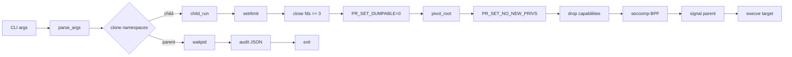
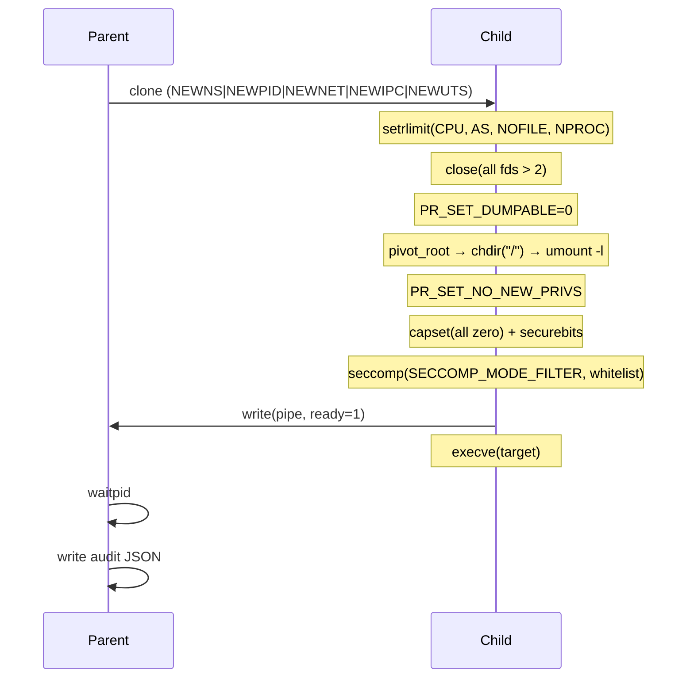

# Z-Jail

Multi-layer sandbox for native code execution on Linux. Seven independent defence layers stack to contain untrusted binaries — no external dependencies, ~130 KiB PIE binary.

```text
┌──────────────────────────────────────────────────────┐
│                    Z-Jail                             │
├──────────────────────────────────────────────────────┤
│  Truthimatics  (evidence-based verdict engine)       │
│  Namespaces    (mount, pid, net, ipc, uts)          │
│  pivot_root    (chroot on steroids)                 │
│  Capabilities  (drop all, lock securebits)           │
│  NO_NEW_PRIVS  (no privilege escalation)             │
│  seccomp-BPF   (whitelist: 15 syscalls only)         │
│  Audit         (JSON logging + BLAKE2b hashing)      │
└──────────────────────────────────────────────────────┘
```

---

## Table of Contents

- [Quick Start](#quick-start)
- [Why Z-Jail](#why-z-jail)
- [Architecture](#architecture)
- [Layers](#layers)
- [Usage](#usage)
- [Build & Install](#build--install)
- [Testing](#testing)
- [Performance](#performance)
- [Threat Model](#threat-model)
- [Documentation](#documentation)
- [Roadmap](#roadmap)
- [License](#license)

---

## Quick Start

```sh
git clone https://github.com/Zierax/Z-Jail.git
cd Z-Jail
make
sudo ./z_jail --root=/path/to/rootfs --seccomp-enforce -- /bin/ls
```

The `--root` directory should contain a minimal filesystem with the target binary and its dependencies (for static binaries, just the binary is enough).

---

## Why Z-Jail

Existing sandboxing solutions make trade-offs:

|                    | **Z-Jail**  | **Firecracker** | **gVisor** | **bwrap** | **nsjail** |
|--------------------|-------------|-----------------|------------|-----------|------------|
| External deps      | **zero**    | libc, seccomp   | Go runtime | libc      | libc, protobuf |
| Binary size        | **~130 KiB**| 20+ MiB         | 40+ MiB    | ~70 KiB   | ~1 MiB     |
| VM isolation       | no          | yes             | no         | no        | no         |
| seccomp whitelist  | **yes**     | no              | yes        | optional  | yes        |
| Content hashing    | **yes**     | no              | no         | no        | no         |
| Audit JSON         | **yes**     | no              | yes        | no        | partial    |
| Build complexity   | **one `make`** | complex     | complex    | trivial   | moderate   |

Z-Jail fills the niche between `bwrap` (minimal, no seccomp-by-default) and `nsjail` (featureful, heavy deps). It is designed for **CI pipelines, CTF jail challenges, and lightweight code evaluation** where you need defence-in-depth without pulling in a container runtime.

---

## Architecture

### Data Flow



### Layer Ordering

Each layer is ordered so that a later layer can't be undone by an earlier one:

1. **setrlimit** — cap CPU, address space, file count, processes before anything else
2. **fd scrub** — close all inherited fds except the report pipe
3. **PR_SET_DUMPABLE=0** — core dumps disabled, /proc/self/mem locked down
4. **pivot_root** — detach from host filesystem; old root unmounted lazily
5. **PR_SET_NO_NEW_PRIVS** — no setuid, no `capset` escalation after this point
6. **drop_caps** — zero out all capabilities, lock securebits
7. **seccomp-BPF** — restrict syscalls to whitelist only
8. **signal parent** — tell the parent the sandbox is ready
9. **execve** — replace process with the target binary



---

## Layers

### 1. Truthimatics
Evidence-based verdict engine. Collects weighted observations about the executed binary and determines a final verdict (`DETERMINISTIC`, `REJECT`, or `UNCERTAIN`). Each observation carries a weight; any single observation with weight >50% of total decides the verdict.

### 2. Namespaces
Five namespaces are created via `clone()`:

| Namespace | Flag | Purpose |
|-----------|------|---------|
| Mount     | `CLONE_NEWNS` | Isolated filesystem tree |
| PID       | `CLONE_NEWPID` | Process ID space (child is pid 1) |
| Net       | `CLONE_NEWNET` | No network interfaces |
| IPC       | `CLONE_NEWIPC` | No shared memory / semaphores |
| UTS       | `CLONE_NEWUTS` | Separate hostname |

Requires `CAP_SYS_ADMIN` in the initial namespace.

### 3. pivot_root
Replaces the mount namespace root with the `--root` directory:

1. Bind-mount the root directory onto itself (`MS_BIND|MS_REC`)
2. `pivot_root(new_root, put_old)` — swap the mount tree
3. `chdir("/")` — move into the new root
4. `umount2("/.pivot_old", MNT_DETACH)` — detach old root
5. `rmdir("/.pivot_old")` — clean up

This is strictly stronger than `chroot(2)` — there is no way for the sandboxed process to escape back to the host root, even with `CLONE_NEWNS` from inside the sandbox (which is already blocked by seccomp).

### 4. Capabilities
All capabilities are dropped via:

```c
capset(hdr, data)  // data = {0, 0, 0}
prctl(SECBIT_KEEP_CAPS_LOCKED | SECBIT_NO_SETUID_FIXUP | ...)
```

The process drops `setuid`/`setgid` *before* `capset` so the uid change takes effect while `CAP_SETUID` is still held. After `capset`, all caps are gone and the securebits are locked — no re-enablement is possible.

### 5. NO_NEW_PRIVS
```c
prctl(PR_SET_NO_NEW_PRIVS, 1, 0, 0, 0);
```

Prevents the process or its children from gaining new privileges via `setuid` binaries, file capabilities, or `LSM` transitions. Irreversible.

### 6. seccomp-BPF (whitelist-v1)

Allow-list of 15 syscalls — anything not on the list gets `SECCOMP_RET_KILL`:

| Syscall | Number | Notes |
|---------|--------|-------|
| `read` | 0 | stdin |
| `write` | 1 | stdout/stderr + report pipe |
| `openat` | 257 | file access (not `open`) |
| `close` | 3 | — |
| `lseek` | 8 | — |
| `brk` | 12 | heap management |
| `mmap` | 9 | arg-restricted: `flags & 4 == 0` (no MAP_SHARED), `flags == 0x22` (MAP_PRIVATE\|MAP_ANONYMOUS) |
| `munmap` | 11 | — |
| `execve` | 59 | single exec at startup |
| `exit_group` | 231 | clean process exit |
| `rt_sigaction` | 13 | signal handlers |
| `rt_sigprocmask` | 14 | signal masking |
| `getrandom` | 318 | random number source |
| `clock_gettime` | 228 | timing |
| `fstat` | 5 | file metadata |

The BPF filter is generated dynamically: for each whitelist entry, a jump chain is emitted that either allows (if syscall matches) or falls through to KILL. Architecture is checked first (`AUDIT_ARCH_X86_64`).

The filter is verified independently by a standalone test (`tests/seccomp_filter_test.c`, 8/8 pass) that fork+execves test cases against a real `prctl(PR_SET_SECCOMP)` without needing root.

### 7. Audit
Every execution produces a JSON audit record:

```json
{
  "schema": "z-jail.audit/v1",
  "build_id": "Z-Jail/v1+dev",
  "timestamp": 1749000000,
  "duration_ns": 8500000,
  "executable": "/bin/ls",
  "verdict": "DETERMINISTIC",
  "exit_code": 0,
  "sandbox": {
    "seccomp_filter": "whitelist-v1",
    "seccomp_whitelist_size": 15,
    "seccomp_arg_rules_size": 2,
    "namespaces": ["mount","pid","net","ipc","uts"],
    "pivot_root": "/var/run/z-jail/roots/default",
    "no_new_privs": true,
    "capabilities_dropped": true
  },
  "content_fingerprint": "0e5751c026e543b2e8ab2eb06099daa1..."
}
```

Written to `build/audits/<binary-name>.audit.json`. The `content_fingerprint` is a BLAKE2b-256 hash of the target binary, computed by the parent after the child finishes.

---

## Usage

```text
z_jail --root=<dir> [--seccomp-enforce] [--self-hash=<hex>]
       [--quiet] [--verbose] -- <program> [args...]
```

| Flag | Description |
|------|-------------|
| `--root=<dir>` | Sandbox root directory (required) |
| `--seccomp-enforce` | Enable seccomp-BPF syscall whitelist |
| `--self-hash=<hex>` | Verify binary matches expected BLAKE2b-256 hash |
| `--quiet` | Suppress audit output |
| `--verbose` | Enable debug logging |
| `--version` | Show build ID (`Z-Jail/v1+dev`) |
| `--help` | Show usage and exit |

### Examples

```sh
# Run a static binary with all protections
sudo z_jail --root=./roots --seccomp-enforce -- bin/hello_static

# Run with binary integrity verification
sudo z_jail --root=./roots --seccomp-enforce \
  --self-hash=$(sha256sum z_jail | cut -c1-64) -- bin/program

# Quiet mode (no audit JSON)
sudo z_jail --root=./roots --quiet -- bin/program
```

### Exit Codes

| Code | Meaning |
|------|---------|
| 0 | Child exited normally (verdict: DETERMINISTIC) |
| 1 | Child was killed by signal (verdict: REJECT) |
| 2 | Self-hash: bad hex string or file unreadable |
| 3 | Self-hash: mismatch (binary has been tampered with) |
| 101 | Child setup error (rlimit, etc.) |
| 102 | Child seccomp filter installation failed |
| 103 | Child execve failed (binary not found, no exec permission) |
| 104 | Child pivot_root failed |
| 105 | Child capability drop failed |
| 125 | Namespace creation failed (run as root? kernel support?) |

---

## Build & Install

### Requirements

- Linux kernel ≥ 5.4 (namespaces, seccomp-BPF, pivot_root)
- GCC ≥ 11 (tested on 11.4, 13.2, 15.2)
- No external libraries — just the standard C toolchain

### Commands

```sh
make              # build z_jail (~130 KiB PIE binary)
make install      # install to /usr/local/bin + man page
make clean        # remove build artifacts
make dist         # create release tarball
make check        # smoke test (--version + --help)
```

The binary is built as a Position Independent Executable with `-fstack-protector-strong`, `-D_FORTIFY_SOURCE=2`, full RELRO, and `-z now`.

### Compile-time Options

```sh
make CC=clang CFLAGS="-O3 -march=native"   # custom compiler/flags
```

---

## Testing

### Quick Test (no root)

```sh
# seccomp filter logic (8 tests)
tests/build/seccomp_filter_test

# BLAKE2b known-answer test
tests/build/blake2b_known
```

These don't need root and run in under 100 ms.

### Full Test Suite

```sh
make -C tests setup          # build payloads + test roots
sudo bash tests/run_tests.sh # 17 scenarios
```

Requires root for namespace creation. The test suite covers:

| # | Scenario | Type | What it tests |
|---|----------|------|---------------|
| 0 | blake2b_regress | known-answer | BLAKE2b implementation correctness |
| 1 | seccomp_filter | standalone BPF | 8 sub-tests of the BPF filter logic |
| 2 | hello_static | ok | Basic static binary execution |
| 3 | hello_dynamic | ok | Dynamic binary with ld-linux + libc |
| 4 | execve_replacement | ok | execve in sandbox (blocked by seccomp) |
| 5 | fd_inherited_read | ok | stdin/stdout inherited correctly |
| 6 | mmap_bad_flags | killed | mmap with MAP_SHARED blocked |
| 7 | mmap_good_allowed | ok | mmap with MAP_PRIVATE\|ANONYMOUS allowed |
| 8 | mmap_prot_exec | killed | mmap with PROT_EXEC blocked |
| 9 | mmap_self_modify | killed | Self-modifying code blocked |
| 10 | ptrace | killed | ptrace blocked |
| 11 | socket | killed | socket creation blocked |
| 12 | chroot_escape | killed | chroot syscall blocked |
| 13 | double_chroot | killed | Double chroot blocked |
| 14 | mount_replay | killed | Mount syscall blocked |
| 15 | cpu_exhaust | killed | RLIMIT_NPROC blocks fork bomb |
| 16 | signal_parent | killed | Signal to parent blocked |
| 17 | self_hash | ok | Binary integrity verification |

---

## Performance

Numbers from WSL2 (Kali Linux, GCC 15.2.0, -O2 -g):

| Metric | Value |
|--------|-------|
| Binary size | ~130 KiB |
| Mean sandbox latency | ~8 ms |
| Peak RSS | ~4 MiB |
| Lines of code (core) | ~900 |
| Test suite runtime | ~5 s |

Latency breakdown (approx): clone + namespaces ~3 ms, pivot_root ~2 ms, seccomp + caps ~1 ms, execve ~1 ms, waitpid + audit ~1 ms.

---

## Threat Model

### In Scope
- Arbitrary native code execution by an untrusted payload
- Escape via `chroot`, `mount`, `ptrace`, `socket`, `process_vm_writev`
- Fork bombs, CPU exhaustion (`RLIMIT_CPU`), memory exhaustion (`RLIMIT_AS`)
- File descriptor leaks across `execve`
- `setuid` / dynamic linker / `LD_PRELOAD` escalation
- seccomp filter removal or capability re-enablement

### Out of Scope
- Kernel zero-days outside the permitted syscall surface
- Hardware side channels (Spectre, Meltdown)
- Co-located VM escape via shared `/proc`, `/sys` mounts
- Network egress beyond what `CLONE_NEWNET` + blocked `socket` provides
- Resource starvation of sibling sandboxes (needs cgroup support)

### Assumptions
- Host kernel is unmodified Linux ≥ 5.4
- `clone(CLONE_NEWNS|CLONE_NEWPID|...)` succeeds (requires `CAP_SYS_ADMIN`)
- Target binary is statically linked (or dynamic libraries are available in `--root`)
- `--self-hash=<hex>` is configured in production deployments

---

## Documentation

| File | Description |
|------|-------------|
| `README.md` | This file |
| `docs/ARCHITECTURE.md` | Architecture overview |
| `docs/SANDBOX.md` | Layer-by-layer sandbox internals |
| `docs/SECCOMP.md` | seccomp-BPF whitelist design |
| `docs/AUDIT_SCHEMA.md` | Audit JSON schema reference |
| `docs/THREAT_MODEL.md` | Security assumptions and scope |
| `docs/BLAKE2B.md` | BLAKE2b implementation details |
| `docs/BENCHMARKS.md` | Performance benchmarks |
| `docs/BUILD.md` | Build instructions |
| `docs/adr/` | Architecture Decision Records (4 docs) |
| `man/z_jail.1` | Man page |
| `SECURITY.md` | Security policy and reporting |
| `CONTRIBUTING.md` | How to contribute |
| `CHANGELOG.md` | Release history |
| `ROADMAP.md` | Future plans |
| `TODO.md` | Known gaps and planned work |

---

## Roadmap

### v1 (current)
- 7-layer defence-in-depth sandbox
- BLAKE2b-256 content fingerprinting
- Audit JSON output
- 17 test scenarios
- man page, completions (bash, zsh, fish)

### v2 (planned)
- External seccomp policy file (JSON or BPF source)
- Custom namespace flags per sandbox instance
- Configurable syscall whitelist via CLI
- Performance profiling hooks for CI integration
- Release signing (minisign/signify)

---

## License

MIT. See `LICENSE` for the full text.

---

*Z-Jail was built on WSL2 (Kali Linux, GCC 15.2.0), targeting Linux 5.4+.*
*Maintained by [Zierax](https://github.com/Zierax). Report issues at the [issue tracker](https://github.com/Zierax/Z-Jail/issues).*
